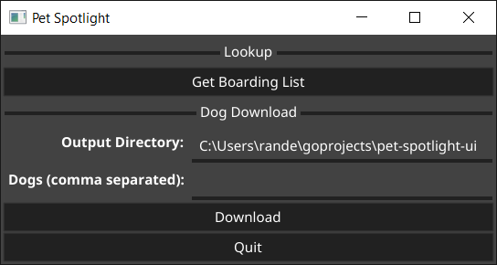
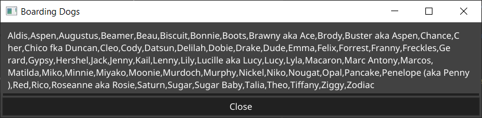
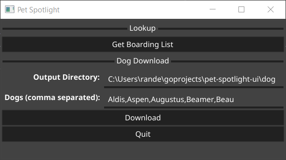
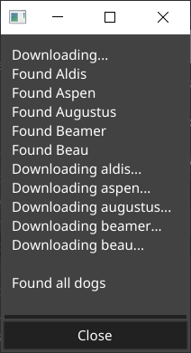

# Pet Spotlight
This is a UI tool used to quickly download description and all images related to dogs. Description and images are saved to the specified location.

Currently the tool only works for the Foster Organization [2 Blondes All Breed Rescue](https://2babrescue.com/).

## Download
Visit the [Releases](https://github.com/Piszmog/pet-spotlight-ui/releases) page to download the Windows Binary.

## Running
Simply double click the executable to launch the application.

You will be greeted with the initial window,

There is a button called `Get Boarding List`. If you click it, a new window will popup with the list of dogs that 
need fosters. 

If you want to download descriptions, images, and videos of dogs, populate the `Dog Download` form.

When you click the `Download` button, a new popup will show up providing you with updates.

## Building
To build the CLI tool, there is a `makefile` provided. However, to run the `makefile` required Windows and `nmake`.

e.g. `nmake all`